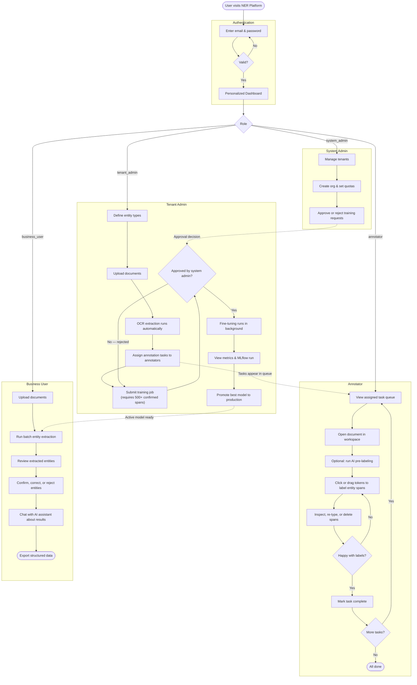

# NER Platform — Identity, Tenant Entity Configuration, Annotation Workspace & Training Pipeline (SM-01→SM-04)

## User Workflow

The platform has four roles. Below is the end-to-end journey each role takes, and how they hand off to one another.



**How the roles connect:**
- The **Tenant Admin** defines the workspace (entities, documents, tasks) and drives the training lifecycle.
- **Annotators** work through their assigned task queue and build the labeled dataset the model trains on.
- The **System Admin** acts as a gatekeeper, approving training jobs before GPU resources are consumed.
- Once a model is promoted, **Business Users** can run extractions and query results through the AI chat assistant.

---

## Database Schemas

### `public` Schema — Global tables (shared across all tenants)

| Table | Columns | Description |
|-------|---------|-------------|
| `tenants` | `id` (UUID), `name`, `slug` (unique), `status` (active/inactive), `max_users`, `max_documents`, `max_storage_gb`, `max_model_versions`, `created_at`, `updated_at` | Tenant organizations. Each tenant gets an isolated schema on creation. |
| `tenant_users` | `id` (UUID), `tenant_id` (FK→tenants), `email` (unique per tenant), `password_hash`, `role` (system_admin/tenant_admin/business_user/annotator), `status` (active/inactive), `created_at` | User accounts scoped to a tenant. Email uniqueness enforced per-tenant. |
| `entity_definitions` | `id` (UUID), `tenant_id` (FK→tenants), `name`, `description`, `examples` (JSON), `validation_rule`, `target_table`, `base_label_mapping` (JSON), `version`, `required_flag`, `is_active`, `created_at`, `updated_at` | Custom entity types defined per tenant. Version increments on update. `base_label_mapping` maps CoNLL labels (PER/ORG/LOC/MISC) to tenant-specific types. |

### `tenant_template` Schema — Blueprint for tenant-isolated schemas

Created by migration `002`, extended by `003` and `004`. When a tenant is provisioned, `CREATE SCHEMA tenant_{id}` copies this structure:

| Table | Purpose | Added In |
|-------|---------|----------|
| `documents` | Uploaded files per tenant | SM-02 (migration 002) |
| `document_text_spans` | OCR/extracted text spans per document | SM-02 (migration 002) |
| `annotation_tasks` | Human annotation task assignments | SM-01 (migration 002), altered in SM-03 (migration 004) |
| `spans` | Confirmed entity span annotations (char_start, char_end, entity_type, text_content, confidence) | SM-03 (migration 004) |
| `suggested_spans` | Pre-labeling suggestions with confidence score | SM-03 (migration 004) |
| `annotation_labels` | Labels applied during annotation | SM-01 (migration 002, future use) |
| `training_jobs` | Fine-tuning job records (status, hyperparams, metrics, error_message, celery_task_id, mlflow_run_id, mlflow_run_url) | SM-04 (migration 005 + 006) |
| `model_versions` | Trained model artifacts (version_number, training_job_id, status, metrics, artifact_path, mlflow_run_id) | SM-04 (migration 005 + 006) |
| `extraction_runs` | Model inference runs | SM-01 (migration 002, future use) |
| `extracted_entities` | Entities found by extraction | SM-01 (migration 002, future use) |
| `audit_log` | Tenant-scoped audit trail | SM-01 (migration 002, future use) |

**SM-03 additions to `annotation_tasks`:** columns `annotator_user_id` (VARCHAR), `updated_at` (TIMESTAMPTZ), default status changed to `unannotated`. Unique partial index `idx_task_active_document` prevents two annotators from working on the same document simultaneously.

**SM-04 additions (migration 006):** `training_jobs` gained `mlflow_run_id` (VARCHAR) and `mlflow_run_url` (TEXT). `model_versions` gained `mlflow_run_id` (VARCHAR) to link each trained model to its MLflow run. `mlflow_run_url` for model versions is computed at response time from the tracking URI.

## Prerequisites

```bash
docker compose up -d postgres-test minio redis    # Start PostgreSQL 16, MinIO S3, Redis
docker compose up -d mlflow                       # Start MLflow Tracking Server (PostgreSQL backend + MinIO artifact store)
pip install -r requirements.txt                   # or poetry install
alembic upgrade head                              # Run migrations
python -m src.gateway.seed                        # Create bootstrap admin
```

## Starting the Servers

The platform runs three services that can be started independently:

### Gateway (Auth, Tenants, Users, Entity Types)

```bash
uvicorn src.gateway.main:app --reload    # http://localhost:8000/docs
```

### Document Ingestion Service

```bash
uvicorn src.document_service.main:app --port 8001 --reload   # http://localhost:8001/docs
```

### Annotation Service

```bash
uvicorn src.annotation_service.main:app --port 8002 --reload   # http://localhost:8002/docs
```

### Training Service

```bash
uvicorn src.training_service.main:app --port 8003 --reload    # http://localhost:8003/docs
```

**Celery worker** (processes training jobs in the background):
```bash
celery -A src.training_service.celery_app worker --loglevel=info --concurrency=1
```

### Model-Serving Service

```bash
uvicorn src.model_serving.main:app --port 8004 --reload   # http://localhost:8004/docs
```

### Extraction Service

```bash
uvicorn src.extraction_service.main:app --port 8005 --reload   # http://localhost:8005/docs
```

---

## API Endpoints

### Auth (`/api/v1/auth`)

#### POST `/api/v1/auth/login`
Authenticate a user and receive JWT tokens.

**Request body:**
```json
{
  "email": "admin@nerplatform.io",
  "password": "Admin123!"
}
```

**Response `200`:**
```json
{
  "access_token": "eyJ...",
  "refresh_token": "eyJ...",
  "token_type": "bearer",
  "user": {
    "id": "uuid",
    "email": "admin@nerplatform.io",
    "role": "system_admin",
    "tenant_id": "system",
    "tenant_slug": null
  }
}
```

**Response `401`:**
```json
{
  "error": { "code": "AUTH_ERROR", "message": "Invalid email or password" }
}
```

**JWT claims:** `sub` (tenant_id:user_id), `tenant_id`, `user_id`, `role`, `type` (access), `iat`, `exp`

**Storage:** Reads from `public.tenant_users` + `public.tenants`.

---

#### POST `/api/v1/auth/refresh`
Exchange a refresh token for a new access + refresh token pair.

**Request body:**
```json
{ "refresh_token": "eyJ..." }
```

**Response `200`:** Same token structure as login.

**Storage:** No DB write — token is decoded and re-issued.

---

#### POST `/api/v1/auth/logout`
Stub — does nothing currently. Intended to add the access token to a Redis blacklist.

**Request body:**
```json
{ "access_token": "eyJ..." }
```

**Response `200`:**
```json
{ "message": "Logged out successfully" }
```

---

### Admin - Tenants (`/api/v1/admin/tenants`)

All endpoints require `Authorization: Bearer <token>` with `role: system_admin`.

#### POST `/api/v1/admin/tenants` (201)
Create a new tenant with isolated PostgreSQL schema.

**Request body:**
```json
{
  "name": "Acme Corp",
  "slug": "acme-corp",
  "max_users": 10,
  "max_documents": 1000,
  "max_storage_gb": 5,
  "max_model_versions": 10
}
```
All fields except `name` are optional (slug auto-generated, quotas get defaults).

**Response `201`:**
```json
{
  "tenant": {
    "id": "uuid",
    "name": "Acme Corp",
    "slug": "acme-corp",
    "status": "active",
    "max_users": 10,
    ...
    "created_at": "2026-06-08 ...",
    "updated_at": "2026-06-08 ..."
  }
}
```

**Response `409`:** Duplicate slug.
```json
{
  "error": { "code": "CONFLICT", "message": "Tenant with slug 'acme-corp' already exists" }
}
```

**Storage:** `INSERT INTO public.tenants` + `CREATE SCHEMA tenant_{id}`.

---

#### GET `/api/v1/admin/tenants`
List tenants with pagination and optional status filter.

**Query params:** `?status=active&page=1&per_page=10`

**Response `200`:**
```json
{
  "tenants": [{ "id": "...", "name": "...", "slug": "...", "status": "active", ... }],
  "total": 25,
  "page": 1,
  "per_page": 10
}
```

**Storage:** `SELECT FROM public.tenants` with LIMIT/OFFSET.

---

#### GET `/api/v1/admin/tenants/{id}`
Get tenant detail with current user count.

**Response `200`:**
```json
{
  "tenant": {
    "id": "uuid",
    "name": "Acme Corp",
    "slug": "acme-corp",
    "status": "active",
    "user_count": 3,
    ...
  }
}
```

**Response `404`:**
```json
{
  "error": { "code": "NOT_FOUND", "message": "Tenant 'uuid' not found" }
}
```

**Storage:** `SELECT FROM public.tenants` + `COUNT FROM public.tenant_users`.

---

#### PUT `/api/v1/admin/tenants/{id}`
Update tenant metadata or quotas. Only `name`, `max_users`, `max_documents`, `max_storage_gb`, `max_model_versions` are updatable.

**Request body:** (partial update — send only changed fields)
```json
{ "max_users": 25, "name": "Acme Corp Updated" }
```

**Response `200`:** Same tenant object with updated fields.

---

#### POST `/api/v1/admin/tenants/{id}/deactivate`
Deactivate a tenant. Sets `status: inactive`. Subsequent tenant-scoped requests return 403.

**Response `200`:**
```json
{
  "tenant": { "id": "...", "status": "inactive", ... }
}
```

---

### Users (`/api/v1/tenants/{slug}/users`)

Requires `role: tenant_admin`. The slug in the URL is resolved to a tenant ID and validated against the JWT.

#### POST `/api/v1/tenants/{slug}/users` (201)
Create a user within the tenant. Checks `max_users` quota.

**Request body:**
```json
{
  "email": "user@acme.com",
  "password": "StrongPass1",
  "role": "annotator"
}
```
Password rules: min 8 chars, 1 uppercase, 1 lowercase, 1 digit. Role must be one of: `tenant_admin`, `business_user`, `annotator`.

**Response `201`:**
```json
{
  "user": {
    "id": "uuid",
    "email": "user@acme.com",
    "role": "annotator",
    "status": "active"
  }
}
```

**Response `429`:** Quota exceeded.
```json
{
  "error": { "code": "QUOTA_EXCEEDED", "message": "Users quota exceeded (limit: 5)" }
}
```

---

#### GET `/api/v1/tenants/{slug}/users`
List users for the tenant. Optional `?role=annotator` filter.

**Response `200`:**
```json
{
  "users": [{ "id": "...", "email": "...", "role": "annotator", "status": "active", "created_at": "..." }]
}
```

---

#### GET `/api/v1/tenants/{slug}/users/{uid}`
Get user detail.

**Response `200`:**
```json
{
  "user": {
    "id": "uuid",
    "email": "user@acme.com",
    "role": "annotator",
    "status": "active",
    "created_at": "2026-06-08T10:00:00Z"
  }
}
```

**Response `404`:**
```json
{
  "error": { "code": "NOT_FOUND", "message": "User 'uuid' not found" }
}
```

---

#### PUT `/api/v1/tenants/{slug}/users/{uid}`
Update user role or status. Allowed fields: `role`, `status`.

**Request body:** (partial update — send only changed fields)
```json
{ "role": "business_user" }
```

**Response `200`:**
```json
{
  "user": {
    "id": "uuid",
    "email": "user@acme.com",
    "role": "business_user",
    "status": "active"
  }
}
```

---

#### DELETE `/api/v1/tenants/{slug}/users/{uid}`
Soft-delete — sets `status: inactive`.

**Response `200`:**
```json
{
  "user": {
    "id": "uuid",
    "email": "user@acme.com",
    "role": "annotator",
    "status": "inactive"
  }
}
```

---

### Entity Types (`/api/v1/entity-types`)

**Service:** `src.gateway.main:app` — port 8000
**Swagger UI:** `http://localhost:8000/docs`

Requires `Authorization: Bearer <token>` with any valid tenant-scoped role. The tenant is resolved from the JWT automatically — no slug needed in the URL.

#### POST `/api/v1/entity-types` (201)
Create an entity type with optional `base_label_mapping`. Only `name` is required.

**Request body:** (minimum)
```json
{ "name": "per_name" }
```

**Request body:** (full)
```json
{
  "name": "vendor_name",
  "description": "Name of a vendor/supplier",
  "examples": ["Acme Supplies", "Global Tech Ltd"],
  "validation_rule": null,
  "target_table": "vendors",
  "base_label_mapping": { "ORG": ["vendor_name"] },
  "required_flag": true
}
```

**`base_label_mapping` keys must be one of:** `PER`, `ORG`, `LOC`, `MISC`. Anything else returns 422.

**Response `201`:**
```json
{
  "entity_type": {
    "id": "uuid",
    "name": "vendor_name",
    "version": 1,
    "is_active": true,
    "base_label_mapping": { "ORG": ["vendor_name"] },
    ...
  }
}
```

**Response `422`:** Invalid label key or missing `name`.
```json
{
  "error": {
    "code": "VALIDATION_ERROR",
    "message": "Invalid base model label 'INVALID_LABEL'. Must be one of: LOC, MISC, ORG, PER"
  }
}
```

**Response `404`:** JWT tenant not found or deactivated.

**Storage:** `INSERT INTO public.entity_definitions`.

---

#### GET `/api/v1/entity-types`
List entity types. Optional `?is_active=true` filter.

**Response `200`:**
```json
{
  "entity_types": [
    { "id": "...", "name": "vendor_name", "version": 1, "is_active": true, ... },
    { "id": "...", "name": "customer_name", "version": 3, "is_active": false, ... }
  ]
}
```

---

#### GET `/api/v1/entity-types/{id}`
Get entity type by ID.

**Response `404`:** Entity type not found.

---

#### PUT `/api/v1/entity-types/{id}`
Update entity type. Increments `version`. `name` and `base_label_mapping` can be updated; mapping re-validated.

**Response `200`:**
```json
{
  "entity_type": { "id": "...", "name": "vendor_name", "version": 2, ... }
}
```

---

#### DELETE `/api/v1/entity-types/{id}`
Soft-delete — sets `is_active: false`.

**Response `200`:** Entity type with `is_active: false`.

---

### Dashboard (`/api/v1/dashboard`)

**Service:** `src.gateway.main:app` — port 8000
**Swagger UI:** `http://localhost:8000/docs`

Requires `Authorization: Bearer <token>` with any valid tenant-scoped role. The tenant is resolved from the JWT. `system_admin` users receive platform-wide aggregates; tenant-scoped roles receive tenant-specific stats.

#### GET `/api/v1/dashboard/summary`
Returns summary statistics for the authenticated user's role.

**Response `200`:**
```json
{
  "data": { ... },
  "sources": {
    "tenants": true,
    "training": true,
    "documents": true,
    "annotations": true,
    "models": true
  }
}
```

---

### Document Ingestion (`/api/v1/documents`)

**Service:** `src.document_service.main:app` — port 8001
**Swagger UI:** `http://localhost:8001/docs`

Requires `Authorization: Bearer <token>` with any valid tenant-scoped role. The tenant is resolved from the JWT — no slug needed in the URL.

#### POST `/api/v1/documents` (201)
Upload a document for OCR processing. Accepted types: `.pdf`, `.jpg`, `.jpeg`, `.png`, `.tif`, `.tiff`. Max file size: 50MB.

**Request:** `multipart/form-data`
```
file: <binary>
```

**Response `201`:**
```json
{
  "id": "uuid",
  "filename": "invoice.pdf",
  "content_type": "application/pdf",
  "file_size": 245760,
  "status": "pending",
  "created_at": "2026-06-09T10:00:00Z",
  "updated_at": "2026-06-09T10:00:00Z"
}
```

**Response `413`:** File too large.
```json
{
  "error": { "code": "FILE_TOO_LARGE", "message": "File size exceeds maximum allowed size of 52428800 bytes" }
}
```

**Response `422`:** Unsupported file type.
```json
{
  "error": { "code": "UNSUPPORTED_FILE_TYPE", "message": "Unsupported file type: .exe. Allowed: .pdf, .jpg, .jpeg, .png, .tif, .tiff" }
}
```

**Storage:** Streams file to MinIO at `tenants/{tid}/documents/{docId}.{ext}`, inserts record in `tenant_{tid}.documents` with `status: "pending"`.

---

#### GET `/api/v1/documents`
List documents for the tenant with optional status filter and pagination.

**Query params:** `?status=processed&page=1&per_page=10`

**Response `200`:**
```json
{
  "documents": [
    {
      "id": "uuid",
      "filename": "invoice.pdf",
      "content_type": "application/pdf",
      "file_size": 245760,
      "status": "processed",
      "error_message": null,
      "blob_path": "tenants/{tid}/documents/{docId}.pdf",
      "created_at": "2026-06-09T10:00:00Z",
      "updated_at": "2026-06-09T10:05:00Z"
    }
  ],
  "total": 1,
  "page": 1,
  "per_page": 10
}
```

**Storage:** `SELECT FROM tenant_{tid}.documents` with `WHERE status = ?` and LIMIT/OFFSET.

---

#### GET `/api/v1/documents/{doc_id}`
Get a single document's metadata and processing status.

**Response `200`:**
```json
{
  "id": "uuid",
  "filename": "invoice.pdf",
  "content_type": "application/pdf",
  "file_size": 245760,
  "status": "processed",
  "error_message": null,
  "blob_path": "tenants/{tid}/documents/{docId}.pdf",
  "created_at": "2026-06-09T10:00:00Z",
  "updated_at": "2026-06-09T10:05:00Z"
}
```

**Response `404`:**
```json
{
  "error": { "code": "NOT_FOUND", "message": "Document 'uuid' not found" }
}
```

#### GET `/api/v1/documents/{doc_id}/text`
Return the full OCR-extracted text for a processed document. Text spans are fetched ordered by `span_index` and joined with newlines.

**Response `200`:**
```json
{
  "text": "Invoice #1234\nAcme Corp\nNew York, NY 10001\n..."
}
```

**Response `404`:** Document has no extracted text spans (not yet processed, or processing failed).
```json
{
  "detail": { "code": "NOT_FOUND", "message": "No text found for document uuid" }
}
```

**Storage:** `SELECT text FROM tenant_{tid}.document_text_spans WHERE document_id = :doc_id ORDER BY span_index`.

---

#### DELETE `/api/v1/documents/{doc_id}`
Soft-delete a document. Sets `status: "deleted"`. The blob remains in MinIO.

**Response `200`:**
```json
{
  "id": "uuid",
  "filename": "invoice.pdf",
  "status": "deleted",
  ...
}
```

---

### Annotation Workspace (`/api/v1/documents/{doc_id}/spans`, `/api/v1/annotation-tasks`, `/api/v1/annotation-export`)

**Service:** `src.annotation_service.main:app` — port 8002
**Swagger UI:** `http://localhost:8002/docs`

Requires `Authorization: Bearer <token>` with any valid tenant-scoped role. The tenant is resolved from the JWT — no slug in the URL.

Annotation tasks follow a three-status lifecycle:
```
unannotated → in-progress → completed
```
A document can have only one active task at a time (enforced by DB unique partial index `idx_task_active_document` on `status IN ('unannotated', 'in-progress')`).

Entity types must be pre-configured via the Gateway's entity-types endpoint. The annotation service validates spans against `public.entity_definitions` for the JWT's tenant.

---

#### Span CRUD

##### POST `/api/v1/documents/{doc_id}/spans` (201)
Create a confirmed entity span on a processed document.

**Request body:**
```json
{
  "entity_type": "ORG",
  "char_start": 0,
  "char_end": 4,
  "text": "Acme",
  "confidence": 1.0
}
```

**Response `201`:**
```json
{
  "id": "uuid",
  "entity_type": "ORG",
  "char_start": 0,
  "char_end": 4,
  "text": "Acme",
  "confidence": 1.0
}
```

**Response `422`:** Invalid entity type (not in `public.entity_definitions` for this tenant).
```json
{
  "detail": { "code": "VALIDATION_ERROR", "message": "Entity type 'INVALID' is not configured for this tenant" }
}
```

**Response `404`:** Document not found or not in `processed` status.

**Storage:** `INSERT INTO tenant_{tid}.spans`.

---

##### GET `/api/v1/documents/{doc_id}/spans`
List confirmed spans for a document.

**Query params:** `?type=suggested` — returns suggested (pre-labeled) spans instead of confirmed spans.

**Response `200`:**
```json
[
  {
    "id": "uuid",
    "entity_type": "ORG",
    "char_start": 0,
    "char_end": 4,
    "text": "Acme",
    "confidence": 1.0,
    "created_at": "2026-06-09T10:00:00Z"
  }
]
```

**Storage:** `SELECT FROM tenant_{tid}.spans` (or `suggested_spans` when `?type=suggested`).

---

##### PATCH `/api/v1/documents/{doc_id}/spans/{span_id}`
Update a span's fields. Allowed fields: `entity_type`, `char_start`, `char_end`, `text`, `confidence`.

**Request body:** (partial)
```json
{ "entity_type": "PER", "confidence": 0.95 }
```

**Response `200`:**
```json
{
  "id": "uuid",
  "entity_type": "PER",
  "char_start": 0,
  "char_end": 4,
  "text": "Acme",
  "confidence": 0.95
}
```

**Response `404`:** Span not found.

**Storage:** `UPDATE tenant_{tid}.spans SET ... WHERE id = :id`.

---

##### DELETE `/api/v1/documents/{doc_id}/spans/{span_id}` (204)
Delete a span. No response body.

**Response `204`:** No content.

**Response `404`:** Span not found.

**Storage:** `DELETE FROM tenant_{tid}.spans WHERE id = :id`.

---

#### Pre-labeling

##### POST `/api/v1/documents/{doc_id}/prelabel`
Generate suggested spans from the tenant's `base_label_mapping`. Uses keyword matching against the document's extracted text. Replaces all existing suggestions for the document.

**Response `200`:**
```json
[
  {
    "id": "uuid",
    "entity_type": "ORG",
    "char_start": 0,
    "char_end": 4,
    "text": "Acme",
    "confidence": 0.85
  }
]
```
Confidence is set to `0.85` for all mock pre-labeling results.

**Response `422`:** Document has no extracted text.

**Storage:** `DELETE FROM tenant_{tid}.suggested_spans WHERE document_id = :doc_id` → `INSERT INTO tenant_{tid}.suggested_spans` — all in a single transaction.

---

##### POST `/api/v1/documents/{doc_id}/spans/promote/{suggest_id}` (201)
Promote a suggested span to a confirmed span. The suggested span is deleted on success.

**Response `201`:**
```json
{
  "id": "uuid",
  "entity_type": "ORG",
  "char_start": 0,
  "char_end": 4,
  "text": "Acme",
  "confidence": 0.85
}
```

**Response `404`:** Suggested span not found.

**Storage:** `INSERT INTO tenant_{tid}.spans` → `DELETE FROM tenant_{tid}.suggested_spans WHERE id = :id` — single transaction.

---

#### Annotation Task Management

##### POST `/api/v1/annotation-tasks` (201)
Create an annotation task linking an annotator to a document. Status starts as `unannotated`.

**Request body:**
```json
{
  "document_id": "uuid",
  "annotator_user_id": "uuid"
}
```

**Response `201`:**
```json
{
  "id": "uuid",
  "document_id": "uuid",
  "annotator_user_id": "uuid",
  "status": "unannotated"
}
```

**Response `409`:** Document already has an active task.
```json
{
  "error": { "code": "CONFLICT", "message": "AnnotationTask with document_id 'uuid' already exists" }
}
```

**Response `422`:** Missing `document_id` or `annotator_user_id`.

**Storage:** `INSERT INTO tenant_{tid}.annotation_tasks`. Lock enforced by unique partial index `idx_task_active_document`.

---

##### GET `/api/v1/annotation-tasks`
List annotation tasks for the tenant.

**Query params:** `?status=unannotated` — filter by status (`unannotated`, `in-progress`, `completed`).

**Response `200`:**
```json
[
  {
    "id": "uuid",
    "document_id": "uuid",
    "annotator_user_id": "uuid",
    "status": "unannotated",
    "created_at": "2026-06-09T10:00:00Z",
    "updated_at": null
  }
]
```

**Storage:** `SELECT FROM tenant_{tid}.annotation_tasks` with optional `WHERE status = :status`.

---

##### PATCH `/api/v1/annotation-tasks/{task_id}`
Update annotation task status. Valid transitions: `unannotated` → `in-progress` → `completed`.

**Request body:**
```json
{ "status": "in-progress" }
```

**Response `200`:**
```json
{
  "id": "uuid",
  "status": "in-progress"
}
```

**Response `422`:** Invalid transition (e.g., `unannotated` → `completed`).
```json
{
  "detail": { "code": "INVALID_TRANSITION", "message": "Cannot transition from 'unannotated' to 'completed'" }
}
```

**Response `422`:** Completing a task with no confirmed spans.
```json
{
  "detail": { "code": "NO_SPANS", "message": "Document must have at least one confirmed span before task can be completed" }
}
```

**Response `404`:** Task not found.

**Storage:** `UPDATE tenant_{tid}.annotation_tasks SET status = :status WHERE id = :id`.

---

#### Annotation Export

##### GET `/api/v1/annotation-export`
Export annotated documents in HuggingFace Dataset JSONL format (one JSON object per line, with `tokens` and `tags` arrays in BIO2 format).

**Query params:** `?entity_types=ORG,PER&document_ids=uuid1,uuid2`

| Param | Type | Description |
|-------|------|-------------|
| `entity_types` | string (optional) | Comma-separated list of entity types to include. Types not in the list get `O` tags. |
| `document_ids` | string (optional) | Comma-separated list of document UUIDs to export. If omitted, exports all documents. |

**Response `200`:** `application/jsonl`
```jsonl
{"tokens": ["Acme", "Corp", "sells", "Widgets", "."], "tags": ["B-ORG", "I-ORG", "O", "O", "O"]}
{"tokens": ["John", "likes", "Widgets", "."], "tags": ["B-PER", "O", "O", "O"]}
```

**Storage:** `SELECT FROM tenant_{tid}.documents` → `SELECT FROM tenant_{tid}.spans` → tokenization via `str.split()` → BIO2 tag encoding.

---

### Training Jobs API (`/api/v1/training-jobs`)

**Service:** `src.training_service.main:app` — port 8003
**Swagger UI:** `http://localhost:8003/docs`

Requires `Authorization: Bearer <token>`. POST and cancel endpoints require `role: tenant_admin`. Approve and reject endpoints require `role: system_admin`. GET and list endpoints are accessible by any role.

The training job lifecycle:
```
pending_approval → queued → running → completed
                               → failed
pending_approval → rejected
pending_approval → cancelled (by tenant admin before approval)
queued → cancelled
running → cancelled
```

---

#### POST `/api/v1/training-jobs` (201)
Submit a new training job for system admin approval. Validates 500+ confirmed spans exist and hyperparameters are in range, then creates the job in `pending_approval` status. A Celery task is NOT enqueued until a system admin approves the job.

**Request body:**
```json
{
  "learning_rate": 2e-5,
  "num_epochs": 3,
  "batch_size": 8,
  "max_seq_length": 128
}
```

| Field | Type | Constraints |
|-------|------|-------------|
| `learning_rate` | float | `> 0` |
| `num_epochs` | int | `1–50` |
| `batch_size` | int | `>= 1` |
| `max_seq_length` | int | `32–512` |

**Response `201`:**
```json
{
  "id": "uuid",
  "status": "pending_approval",
  "hyperparams": { "learning_rate": 2e-5, "num_epochs": 3, "batch_size": 8, "max_seq_length": 128 },
  "current_epoch": null,
  "current_loss": null,
  "metrics": null,
  "error_message": null,
  "model_version_id": null,
  "mlflow_run_id": null,
  "mlflow_run_url": null,
  "created_at": "2026-06-10T12:00:00Z",
  "started_at": null,
  "completed_at": null,
  "failed_at": null
}
```

**Response `422`:** Insufficient entities.
```json
{
  "detail": "Insufficient annotated entities: 42. Minimum 500 required."
}
```

**Response `422`:** Invalid hyperparams (handled by Pydantic — returns field-level validation errors).

**Response `403`:** Non-admin user.

**Storage:** `INSERT INTO tenant_{tid}.training_jobs` with `status = 'pending_approval'` and `celery_task_id = NULL`. No Celery task is enqueued at this point.

---

#### GET `/api/v1/training-jobs`
List training jobs with optional status filter and pagination.

**Query params:** `?status=running&page=1&per_page=20`

| Param | Type | Default | Description |
|-------|------|---------|-------------|
| `status` | string | — | Filter by status: `pending_approval`, `queued`, `running`, `completed`, `failed`, `cancelled`, `rejected` |
| `page` | int | 1 | Page number (≥ 1) |
| `per_page` | int | 20 | Items per page (1–100) |

**Response `200`:**
```json
{
  "items": [
    {
      "id": "uuid",
      "status": "running",
      "hyperparams": { "learning_rate": 2e-5, "num_epochs": 3, "batch_size": 8, "max_seq_length": 128 },
      "current_epoch": 2,
      "current_loss": 0.032,
      "metrics": null,
      "error_message": null,
      "model_version_id": null,
      "mlflow_run_id": "a1b2c3d4e5f6...",
      "mlflow_run_url": "http://localhost:5000/#/experiments/1/runs/a1b2c3d4e5f6...",
      "created_at": "2026-06-10T12:00:00Z",
      "started_at": null,
      "completed_at": null,
      "failed_at": null
    }
  ],
  "total": 1,
  "page": 1,
  "per_page": 20
}
```

**Storage:** `SELECT FROM tenant_{tid}.training_jobs` with optional `WHERE status = :status` and LIMIT/OFFSET.

---

#### GET `/api/v1/training-jobs/{job_id}`
Get a single training job's status and all status-specific fields.

**Response `200` (queued):**
```json
{
  "id": "uuid",
  "status": "queued",
  "hyperparams": { ... },
  "current_epoch": null,
  "current_loss": null,
  "metrics": null,
  "error_message": null,
  "model_version_id": null,
  "mlflow_run_id": null,
  "mlflow_run_url": null,
  "created_at": "...",
  "started_at": null,
  "completed_at": null,
  "failed_at": null
}
```

**Response `200` (running):** Includes `current_epoch`, `current_loss`, `mlflow_run_id`, and `mlflow_run_url`.

**Response `200` (completed):** Includes `metrics` (`eval_loss`, `eval_precision`, `eval_recall`, `eval_f1`) and `model_version_id`.

**Response `200` (failed):** Includes `error_message`.

**Response `404`:**
```json
{
  "detail": "Training job not found"
}
```

**Storage:** `SELECT FROM tenant_{tid}.training_jobs WHERE id = :id`.

---

#### POST `/api/v1/training-jobs/{job_id}/cancel`
Cancel a training job that is in `pending_approval`, `queued`, or `running` status. Revokes the Celery task with `terminate=True` if one exists (no-op for `pending_approval` jobs that haven't been enqueued yet).

**Response `200`:**
```json
{
  "id": "uuid",
  "status": "cancelled",
  ...
}
```

**Response `422`:** Job is already in a terminal state (`completed`, `failed`, `cancelled`).
```json
{
  "detail": "Cannot cancel job in 'completed' status"
}
```

**Response `404`:** Job not found.

**Storage:** `celery_app.control.revoke(task_id, terminate=True)` + `UPDATE tenant_{tid}.training_jobs SET status = 'cancelled'`.

---

#### POST `/api/v1/training-jobs/{job_id}/approve`
Approve a training job. Requires `role: system_admin`. Accepts a `tenant_id` query parameter to specify which tenant owns the job. Enqueues the Celery task and transitions the job from `pending_approval` to `queued`.

**Query params:** `?tenant_id=<uuid>` (required)

**Response `200`:**
```json
{
  "id": "uuid",
  "status": "queued",
  ...
}
```

**Response `422`:**
```json
{
  "detail": "Cannot approve job in 'completed' status"
}
```

**Response `403`:** Non-system-admin.

**Storage:** `celery_app.send_task("fine_tune_model", args=[tenant_id, job_id, hyperparams])` + `UPDATE tenant_{tid}.training_jobs SET status = 'queued', celery_task_id = :task_id`.

---

#### POST `/api/v1/training-jobs/{job_id}/reject`
Reject a training job. Requires `role: system_admin`. Accepts a `tenant_id` query parameter to specify which tenant owns the job and an optional reason. Transitions the job from `pending_approval` to `rejected`.

**Query params:** `?tenant_id=<uuid>` (required)

**Request body:**
```json
{
  "reason": "GPU cluster at capacity"
}
```

**Response `200`:**
```json
{
  "id": "uuid",
  "status": "rejected",
  "error_message": "GPU cluster at capacity",
  ...
}
```

**Response `422`:**
```json
{
  "detail": "Cannot reject job in 'completed' status"
}
```

**Response `403`:** Non-system-admin.

**Storage:** `UPDATE tenant_{tid}.training_jobs SET status = 'rejected', error_message = :reason`.

---

### Extraction Service API (`/api/v1/extract`)

**Service:** `src.extraction_service.main:app` — port 8005
**Swagger UI:** `http://localhost:8005/docs`

Requires `Authorization: Bearer <token>` with `role: tenant_admin` or `role: business_user` for single extraction; batch extraction requires `role: tenant_admin`. The tenant is resolved from the JWT — no `{tid}` in the URL.

The extraction service sends tokens to the model-serving inference endpoint and maps the resulting token-level predictions back to character offsets in the original text. Predictions below the `confidence_threshold` (configurable via `NER_CONFIDENCE_THRESHOLD`) are filtered out. Results are sorted by confidence descending.

---

#### POST `/api/v1/extract`
Run NER inference on a single text string. The text is tokenized (split by whitespace), sent to the inference service, and token-level predictions are mapped back to character offsets.

**Request body:**
```json
{
  "text": "Acme Corp is a leading supplier based in New York."
}
```

| Field | Type | Description |
|-------|------|-------------|
| `text` | string | The input text to extract entities from |

**Response `200`:**
```json
{
  "entities": [
    {
      "entity_type": "B-ORG",
      "value": "Acme",
      "confidence": 0.998,
      "start_offset": 0,
      "end_offset": 4
    },
    {
      "entity_type": "I-ORG",
      "value": "Corp",
      "confidence": 0.997,
      "start_offset": 5,
      "end_offset": 9
    },
    {
      "entity_type": "B-LOC",
      "value": "New",
      "confidence": 0.962,
      "start_offset": 44,
      "end_offset": 47
    },
    {
      "entity_type": "I-LOC",
      "value": "York",
      "confidence": 0.981,
      "start_offset": 48,
      "end_offset": 52
    }
  ],
  "model_version": "3"
}
```

**Response `200` (base model fallback — no promoted model):**
```json
{
  "entities": [
    {
      "entity_type": "B-ORG",
      "value": "Acme",
      "confidence": 0.998,
      "start_offset": 0,
      "end_offset": 4
    }
  ],
  "model_version": "0"
}
```
When the tenant has no promoted fine-tuned model, the system uses the curated base model (`dslim/bert-base-NER`, version `"0"`). The response is identical in structure — only `model_version` differs.

**Response `403`:** Non-admin or non-business-user role.

**Response `400`:**
```json
{
  "detail": "No active model is available for this tenant"
}
```

**Storage:** No DB write — calls `POST /internal/v1/infer` on the model-serving service, then returns mapped entities. Entities are NOT persisted (re-run on every request).

---

#### POST `/api/v1/extract-batch`
Trigger batch extraction via Celery worker. Processes multiple documents asynchronously. Each document's text is fetched from the document service, sent to the inference service, and the resulting entities are persisted in `tenant_{tid}.extracted_entities`.

**Query params:** `?documentIds=uuid1,uuid2`

| Param | Type | Description |
|-------|------|-------------|
| `documentIds` | string | Comma-separated list of document UUIDs to process |

**Response `201` (`201` because a resource is created):**
```json
{
  "run_id": "a1b2c3d4-e5f6-7890-abcd-ef1234567890",
  "status": "queued"
}
```

**Response `403`:** Non-admin role.

**Response `422`:** No document IDs provided.

**Storage:** Creates a Celery task (`run_batch_extraction`) with `args=[tenant_id, run_id, doc_ids]`. The worker inserts rows into `tenant_{tid}.extraction_runs` and `tenant_{tid}.extracted_entities`.

---

#### GET `/api/v1/extract-batch/{run_id}`
Get the status and results of a batch extraction run.

**Response `200` (running):**
```json
{
  "status": "running",
  "total_documents": 5,
  "processed_count": 2,
  "skipped_count": 0,
  "failed_count": 0,
  "started_at": "2026-06-10T12:00:00Z",
  "completed_at": null,
  "model_version": "3"
}
```

**Response `200` (completed):**
```json
{
  "status": "completed",
  "total_documents": 5,
  "processed_count": 5,
  "skipped_count": 0,
  "failed_count": 0,
  "started_at": "2026-06-10T12:00:00Z",
  "completed_at": "2026-06-10T12:01:30Z",
  "model_version": "3"
}
```

**Response `200` (completed with base model):**
```json
{
  "status": "completed",
  "total_documents": 5,
  "processed_count": 5,
  "skipped_count": 0,
  "failed_count": 0,
  "started_at": "2026-06-10T12:00:00Z",
  "completed_at": "2026-06-10T12:01:30Z",
  "model_version": "0"
}
```

**Response `404`:**
```json
{
  "detail": "Extraction run not found"
}
```

**Storage:** `SELECT FROM tenant_{tid}.extraction_runs WHERE id = :run_id`.

---

#### GET `/api/v1/entities`
Query extracted entities with optional filters. Returns entities from batch extraction runs that have been persisted in the database.

**Query params:** `?documentId=uuid&type=ORG&minConfidence=0.9&reviewStatus=unreviewed&page=1&per_page=20`

| Param | Type | Default | Description |
|-------|------|---------|-------------|
| `documentId` | string | — | Filter by document UUID |
| `type` | string | — | Filter by entity type label (e.g., `B-ORG`, `B-PER`) |
| `minConfidence` | float | — | Minimum confidence threshold |
| `reviewStatus` | string | — | Filter by review status: `unreviewed`, `confirmed`, `corrected`, `rejected` |
| `page` | int | 1 | Page number (≥ 1) |
| `per_page` | int | 20 | Items per page (1–100) |

**Response `200`:**
```json
{
  "items": [
    {
      "id": "uuid",
      "run_id": "uuid",
      "entity_id": "B-ORG",
      "value": "Acme Corp",
      "confidence": 0.998,
      "normalized_value": null,
      "source_span_id": null,
      "review_status": "unreviewed",
      "corrected_value": null,
      "corrected_by": null,
      "correction_notes": null
    }
  ],
  "total": 1,
  "page": 1,
  "per_page": 20
}
```

**Storage:** `SELECT FROM tenant_{tid}.extracted_entities` with optional WHERE clauses and LIMIT/OFFSET.

---

#### PATCH `/api/v1/entities/{entity_id}`
Update the review status and/or corrected value for a single extracted entity.

**Request body:**
```json
{
  "review_status": "corrected",
  "corrected_value": "Acme Corporation",
  "correction_notes": "Full legal name per contract"
}
```

| Field | Type | Description |
|-------|------|-------------|
| `review_status` | string | Required. One of: `unreviewed`, `confirmed`, `corrected`, `rejected` |
| `corrected_value` | string | Optional. The human-corrected value for the entity |
| `correction_notes` | string | Optional. Free-text notes about the correction |

**Response `200`:**
```json
{
  "id": "uuid",
  "run_id": "uuid",
  "entity_id": "B-ORG",
  "value": "Acme Corp",
  "confidence": 0.998,
  "normalized_value": null,
  "source_span_id": null,
  "review_status": "corrected",
  "corrected_value": "Acme Corporation",
  "corrected_by": "user-uuid",
  "correction_notes": "Full legal name per contract"
}
```

**Response `404`:**
```json
{
  "detail": "Entity not found"
}
```

**Storage:** `UPDATE tenant_{tid}.extracted_entities SET review_status = :status, corrected_value = :val, corrected_by = :uid, correction_notes = :notes WHERE id = :id`.

---

### Model Registry API (`/api/v1/models`)

**Service:** `src.training_service.main:app` — port 8003
**Swagger UI:** `http://localhost:8003/docs`

Requires `Authorization: Bearer <token>`. GET endpoints are accessible by any role. POST (promote/demote) requires `role: tenant_admin`.

Model version status lifecycle:
```
training → completed → promoted → archived
```

---

#### GET `/api/v1/models`
List all model versions for the tenant, ordered by `version_number` descending.

**Response `200`:**
```json
{
  "items": [
    {
      "id": "uuid",
      "version_number": 3,
      "training_job_id": "uuid",
      "status": "promoted",
      "metrics": { "eval_loss": 0.021, "eval_precision": 0.92, "eval_recall": 0.89, "eval_f1": 0.90 },
      "artifact_path": "tenants/{tid}/models/v1/{version_id}/",
      "mlflow_run_id": "a1b2c3d4e5f6...",
      "mlflow_run_url": "http://localhost:5000/#/experiments/1/runs/a1b2c3d4e5f6...",
      "created_at": "2026-06-10T12:00:00Z",
      "promoted_at": "2026-06-10T12:30:00Z",
      "archived_at": null
    }
  ]
}
```

**Storage:** `SELECT FROM tenant_{tid}.model_versions ORDER BY version_number DESC`.

---

#### GET `/api/v1/models/active`
Get the currently promoted model version. Falls back to the curated base model (`dslim/bert-base-NER`, version 0) when no fine-tuned model has been promoted for the tenant.

**Response `200` (fine-tuned model promoted):**
```json
{
  "id": "uuid",
  "version_number": 3,
  "status": "promoted",
  "artifact_path": "tenants/{tid}/models/v1/{version_id}/",
  "mlflow_run_id": "a1b2c3d4e5f6...",
  "mlflow_run_url": "http://localhost:5000/#/experiments/1/runs/a1b2c3d4e5f6...",
  "metrics": { "eval_f1": 0.90, "eval_precision": 0.92, "eval_recall": 0.89, "eval_loss": 0.021 },
  "label_list": ["O", "B-PER", "I-PER", "B-ORG", "I-ORG", "B-LOC", "I-LOC", "B-MISC", "I-MISC"],
  ...
}
```

**Response `200` (base model fallback — no promoted model):**
```json
{
  "id": "0",
  "version_number": 0,
  "training_job_id": null,
  "status": "promoted",
  "metrics": {
    "label_list": ["O", "B-PER", "I-PER", "B-ORG", "I-ORG", "B-LOC", "I-LOC", "B-MISC", "I-MISC"]
  },
  "artifact_path": "base",
  "mlflow_run_id": null,
  "mlflow_run_url": null,
  "created_at": null,
  "promoted_at": null,
  "archived_at": null,
  "label_list": ["O", "B-PER", "I-PER", "B-ORG", "I-ORG", "B-LOC", "I-LOC", "B-MISC", "I-MISC"]
}
```
Response header: `X-Model-Source: base`, `X-Info: no-promoted-model`.

The base model is treated as conceptual version 0 for every tenant. It reports the standard CoNLL label set (PER, ORG, LOC, MISC in BIO2 format). The `label_list` field is always included in `ModelVersionResponse` and allows callers to map prediction labels to entity types without a separate API call.

**Storage:** `SELECT FROM tenant_{tid}.model_versions WHERE status = 'promoted' LIMIT 1`. When no row is found, returns a synthetic response — no DB row exists for version 0.

---

### Model Serving API

**Service:** `src.model_serving.main:app` — port 8004
**Swagger UI:** `http://localhost:8004/docs`

Requires `Authorization: Bearer <token>` with any valid tenant-scoped role.

All endpoints are prefixed with `/internal/v1/` — they are internal service-to-service endpoints called by the extraction service and the training service.

The model serving service hosts two model execution paths:

1. **Fine-tuned models** — loaded via ONNX Runtime (`ort.InferenceSession`) from MinIO artifact store, cached in-memory via `model_cache`. Used when a tenant has a promoted fine-tuned model (version >= 1).
2. **Base model** — loaded as a singleton Hugging Face `pipeline("ner", model="dslim/bert-base-NER")`. Used **for every tenant** that has no promoted fine-tuned model (fallback). Also used as a fallback when a fine-tuned model fails to load.

Model resolution order for a given tenant:
1. Check if the tenant's promoted model is loaded in cache → use it
2. If not cached, try to download and load the ONNX model from MinIO
3. If no promoted model exists or loading fails → fall back to the base model pipeline

---

#### POST `/internal/v1/infer`
Run token-level NER inference on a pre-tokenized input. Accepts a list of tokens (strings), runs inference through the resolved model, and returns per-token predictions with confidence scores.

**Request body:**
```json
{
  "tokens": ["Acme", "Corp", "is", "a", "leading", "supplier", "based", "in", "New", "York", "."]
}
```

| Field | Type | Description |
|-------|------|-------------|
| `tokens` | array[string] | Pre-tokenized input (whitespace-split). Must not be empty. |

**Response `200` (fine-tuned model):**
```json
{
  "predictions": [
    { "token": "Acme", "label": "B-ORG", "confidence": 0.998 },
    { "token": "Corp", "label": "I-ORG", "confidence": 0.997 },
    { "token": "is", "label": "O", "confidence": 0.999 },
    { "token": "a", "label": "O", "confidence": 0.999 },
    { "token": "leading", "label": "O", "confidence": 0.995 },
    { "token": "supplier", "label": "O", "confidence": 0.993 },
    { "token": "based", "label": "O", "confidence": 0.991 },
    { "token": "in", "label": "O", "confidence": 0.999 },
    { "token": "New", "label": "B-LOC", "confidence": 0.962 },
    { "token": "York", "label": "I-LOC", "confidence": 0.981 },
    { "token": ".", "label": "O", "confidence": 0.999 }
  ],
  "model_version": "3"
}
```

**Response `200` (base model fallback):**
```json
{
  "predictions": [
    { "token": "Acme", "label": "B-ORG", "confidence": 0.998 },
    { "token": "Corp", "label": "I-ORG", "confidence": 0.997 }
  ],
  "model_version": "0"
}
```
When `model_version` is `"0"`, the response also includes the header `X-Model-Source: base`.

**Response `404`:**
```json
{
  "detail": "No model available for this tenant"
}
```
This occurs when both the fine-tuned model AND the base model pipeline fail to initialize.

**Storage:** No DB writes. Calls `_resolve_active_version()` to determine which model to use, then either loads from `model_cache` (fine-tuned ONNX model) or uses the singleton base pipeline. Token-level predictions are returned directly — entities are not persisted here.

---

#### POST `/internal/v1/warmup`
Pre-load a model into memory for a tenant. If `version_number` is provided, that specific version is loaded. Otherwise, the currently promoted (active) version is resolved.

When `version_number` is `0` (base model), this initializes the Hugging Face pipeline singleton — no ONNX artifacts are downloaded. When `version_number` is `>= 1`, the ONNX model artifacts are fetched from MinIO and loaded via ONNX Runtime into the in-memory `model_cache`.

**Request body:** (optional — omit to load active version)
```json
{
  "version_number": 2
}
```

**Response `200` (fine-tuned model):**
```json
{
  "status": "ok",
  "version_number": 2
}
```

**Response `200` (base model):**
```json
{
  "status": "ok",
  "version_number": 0
}
```

**Response `404`:** No active version found, or specified version does not exist / cannot be loaded.
```json
{
  "detail": "Model version v99 could not be loaded"
}
```

**Storage:** For fine-tuned models (version >= 1), calls `download_model_artifacts(tenant_id, version_number)` to fetch ONNX model from MinIO at `tenants/{tid}/models/v{version}/`, then loads it via ONNX Runtime and stores it in the in-memory `model_cache`. For the base model (version 0), initializes the singleton Hugging Face pipeline — no cache entry is created.

---

#### POST `/api/v1/models/{version_id}/promote`
Promote a completed model to production. Auto-archives any previously promoted version. After promoting, the system calls the model-serving warmup endpoint to pre-load the model into the inference cache. If warmup fails (model-serving unavailable), the promote still succeeds — the model is loaded on-demand during the first extraction request.

**Response `200`:**
```json
{
  "id": "uuid",
  "version_number": 3,
  "status": "promoted",
  "mlflow_run_id": "a1b2c3d4e5f6...",
  "mlflow_run_url": "http://localhost:5000/#/experiments/1/runs/a1b2c3d4e5f6...",
  "promoted_at": "2026-06-10T12:30:00Z",
  ...
}
```

**Response `422`:** Model is not in `completed` status.
```json
{
  "detail": "Only completed models can be promoted"
}
```

**Response `403`:** Non-admin user.

**Response `404`:** Version not found.

**Storage:** `UPDATE tenant_{tid}.model_versions SET status = 'archived' WHERE status = 'promoted'` → `UPDATE tenant_{tid}.model_versions SET status = 'promoted', promoted_at = NOW() WHERE id = :id`. Then HTTP POST to model-serving warmup endpoint at `/internal/v1/warmup`.

---

#### POST `/api/v1/models/{version_id}/warmup`
Standalone warmup endpoint — pre-loads a model into the model-serving inference cache without changing its promotion status. Useful for CI/CD pipelines and operators.

**Response `200`:**
```json
{
  "status": "ok",
  "version_number": 1
}
```

**Response `404`:** Version not found.

**Storage:** HTTP POST to model-serving internal warmup endpoint.

---

#### POST `/api/v1/models/{version_id}/demote`
Demote a promoted model back to completed.

**Response `200`:**
```json
{
  "id": "uuid",
  "version_number": 3,
  "status": "completed",
  "promoted_at": null,
  ...
}
```

**Response `422`:** Model is not in `promoted` status.
```json
{
  "detail": "Only promoted models can be demoted"
}
```

**Response `403`:** Non-admin user.

**Response `404`:** Version not found.

**Storage:** `UPDATE tenant_{tid}.model_versions SET status = 'completed' WHERE id = :id`.

---

### MLflow Integration

The training service logs every fine-tuning run to MLflow for experiment tracking, model comparison, and artifact management.

**How it works:**
1. A Celery worker starts a training job → creates an MLflow experiment (per tenant, lazy) and a run
2. The run ID (`mlflow_run_id`) is persisted on the `training_jobs` row when training begins
3. A Hugging Face `MLflowCallback` logs per-epoch metrics (loss, precision, recall, F1) to the run
4. On success, the run ID is propagated to the `model_versions` table so every version links back to its MLflow run
5. The run URL (`mlflow_run_url`) is computed as `{tracking_uri}/#/experiments/{exp_id}/runs/{run_id}` — returned in all API responses

**Environment variable:** `NER_MLFLOW_TRACKING_URI=http://localhost:5000` (`.env.example` line 27).

**Docker Compose:** The MLflow Tracking Server is defined in `docker-compose.yml` with a PostgreSQL backend (`mlflow-db`) and MinIO artifact store — run `docker compose up -d mlflow` to start it.

**Verification:** Navigate to `http://localhost:5000` in a browser. After a successful training run, models appear under the tenant-specific experiment in the MLflow UI.

---

### Chat API — RAG Chatbot (`/api/v1/tenants/{tid}/chat`)

**Service:** `src.chat_api.main:app` — port 8006
**Swagger UI:** `http://localhost:8006/docs`

Requires `Authorization: Bearer <token>` with any valid tenant-scoped role. All endpoints are also proxied through the gateway at the same paths on port 8000.

Rate limit: **60 requests per minute** per tenant (internal clients).

---

#### POST `/api/v1/tenants/{tid}/chat`
Send a message to the RAG chatbot. The orchestrator queries three sources in parallel (SQL over extracted entities, pgvector semantic search over document chunks, live NER inference) and synthesizes an LLM response.

**Request body:**
```json
{
  "message": "How many organizations were extracted?",
  "conversation_id": null
}
```

| Field | Type | Description |
|-------|------|-------------|
| `message` | string | Required. Max 4000 chars. The user's question. |
| `conversation_id` | string or null | Optional. UUID of an existing conversation to continue. If null, a new conversation is created. |

**Response `200`:**
```json
{
  "reply": "Based on the extracted data, there are 3 organizations found.",
  "sources": [
    {
      "source_type": "sql",
      "document_id": null,
      "chunk_index": null,
      "chunk_text": null,
      "relevance_score": 1.0,
      "entity_type": null,
      "value": "[{\"entity_type\": \"B-ORG\", \"count\": 3}]",
      "confidence": null
    },
    {
      "source_type": "document_chunk",
      "document_id": "uuid",
      "chunk_index": 2,
      "chunk_text": "Acme Corp is a supplier...",
      "relevance_score": 0.92,
      "entity_type": null,
      "value": null,
      "confidence": null
    }
  ],
  "conversation_id": "uuid",
  "disclaimer": "This answer was generated by AI and may contain errors. Verify important information against source documents."
}
```

`source_type` is one of: `sql` (entity query results), `document_chunk` (semantic search match), `ner` (live inference entity).

**Response `401`:** Missing/invalid JWT.

**Response `429`:** Rate limit exceeded.
```json
{
  "detail": { "code": "RATE_LIMIT_EXCEEDED", "message": "Rate limit exceeded", "retry_after": 42 }
}
```
Headers: `Retry-After`, `X-RateLimit-Limit`, `X-RateLimit-Remaining`, `X-RateLimit-Reset`.

**Response `403`:** Tenant mismatch or inactive tenant.

**Storage:** Inserts user message + assistant reply into `tenant_{tid}.chat_messages`. Updates `tenant_{tid}.conversations.updated_at`. Reads conversation history from `chat_messages` when `conversation_id` is provided.

---

#### GET `/api/v1/tenants/{tid}/chat/conversations`
List conversations for the authenticated user, ordered by most recent message.

**Response `200`:**
```json
[
  {
    "id": "uuid",
    "title": null,
    "created_at": "2026-06-23 10:00:00+00",
    "message_count": 5
  }
]
```

`title` is always `null` currently (auto-titling not implemented).

**Storage:** `SELECT FROM tenant_{tid}.conversations LEFT JOIN tenant_{tid}.chat_messages` with `WHERE user_id = :uid`, `GROUP BY`, `ORDER BY MAX(created_at) DESC NULLS LAST`.

---

#### GET `/api/v1/tenants/{tid}/chat/conversations/{conv_id}`
Get a single conversation with all its messages.

**Response `200`:**
```json
{
  "id": "uuid",
  "title": null,
  "created_at": "2026-06-23 10:00:00+00",
  "messages": [
    {
      "id": "uuid",
      "role": "user",
      "content": "How many organizations?",
      "sources": null,
      "created_at": "2026-06-23 10:00:00+00"
    },
    {
      "id": "uuid",
      "role": "assistant",
      "content": "Based on the extracted data...",
      "sources": [
        { "source_type": "sql", "value": "..." }
      ],
      "created_at": "2026-06-23 10:00:01+00"
    }
  ]
}
```

**Response `404`:**
```json
{
  "detail": "Conversation 'uuid' not found"
}
```

**Storage:** `SELECT FROM tenant_{tid}.conversations` + `SELECT FROM tenant_{tid}.chat_messages` with `WHERE conversation_id = :cid ORDER BY created_at ASC`.

---

#### DELETE `/api/v1/tenants/{tid}/chat/conversations/{conv_id}` (204)
Delete a conversation and all its messages.

**Response `204`:** No content.

**Response `404`:** Conversation not found.

**Storage:** `DELETE FROM tenant_{tid}.chat_messages WHERE conversation_id = :cid` + `DELETE FROM tenant_{tid}.conversations WHERE id = :cid` in a transaction.

---

### Widget API Keys (`/api/v1/tenants/{tid}/widget-keys`)

**Service:** `src.chat_api.main:app` — port 8006

Requires `Authorization: Bearer <token>` with `role: tenant_admin`. Proxied through the gateway.

Widget API keys are SHA-256 hashed on storage; only the prefix `ner_widget_...` (first 8 chars) is returned on list. The raw key is shown **once** at creation time.

---

#### POST `/api/v1/tenants/{tid}/widget-keys` (201)
Generate a new widget API key for embedding the chat widget on external sites.

**Response `201`:**
```json
{
  "id": "uuid",
  "raw_key": "ner_widget_a1b2c3d4e5f6...",
  "key_prefix": "ner_widg"
}
```

**⚠️ Store `raw_key` — it cannot be retrieved later.** The hashed version is saved in `public.widget_api_keys`.

**Storage:** `INSERT INTO public.widget_api_keys (id, tenant_id, key_hash, key_prefix)`.

---

#### GET `/api/v1/tenants/{tid}/widget-keys`
List active (non-revoked) widget API keys.

**Response `200`:**
```json
[
  {
    "id": "uuid",
    "key_prefix": "ner_widg",
    "created_at": "2026-06-23 10:00:00+00",
    "last_used_at": null
  }
]
```

**Storage:** `SELECT FROM public.widget_api_keys WHERE tenant_id = :tid AND revoked_at IS NULL ORDER BY created_at DESC`.

---

#### DELETE `/api/v1/tenants/{tid}/widget-keys/{key_id}` (204)
Revoke a widget API key. Sets `revoked_at = NOW()`.

**Response `204`:** No content.

**Response `404`:** Key not found or already revoked.

**Storage:** `UPDATE public.widget_api_keys SET revoked_at = NOW() WHERE id = :kid`.

---

### Public Widget API (`/api/v1/public`)

**Service:** `src.chat_api.main:app` — port 8006

Public endpoints are accessible **without** a JWT. Widget authentication uses widget API keys (`Authorization: Bearer ner_widget_...`). CORS is open (`Access-Control-Allow-Origin: *`).

Rate limit: **20 requests per minute** per tenant (widget clients).

---

#### GET `/api/v1/public/widget.js`
Serve the embeddable chat widget JavaScript. Renders a floating chat bubble → chat panel on any website.

**Query params:**

| Param | Type | Description |
|-------|------|-------------|
| `tenant` | string | **Required.** Tenant slug (e.g., `acme-corp`). |

**Response `200`:** `application/javascript`

The JS file self-renders a widget with:
- Floating blue chat bubble (bottom-right)
- Chat panel with message history, text input, send button
- Greeting message: "Hello! I can help you explore your extracted entities..."
- Error handling for network failures and API errors

**Usage in HTML:**
```html
<script src="https://your-domain.com/api/v1/public/widget.js?tenant=acme-corp"></script>
<script>
  // After script loads, the widget renders automatically.
  // To authenticate, set the API key:
  // (Your wrapper code sets nerWidgetApiKey = 'ner_widget_...')
</script>
```

**Storage:** No DB — JS is generated server-side with the tenant slug injected.

---

#### POST `/api/v1/public/chat`
Single-turn chat for widget users. No conversation persistence.

**Headers:** `Authorization: Bearer ner_widget_<key>`

**Request body:**
```json
{
  "message": "What entities were found?"
}
```

| Field | Type | Description |
|-------|------|-------------|
| `message` | string | Required. Max 4000 chars. |

**Response `200`:**
```json
{
  "reply": "The extracted entities include organizations such as Acme Corp...",
  "sources": [
    { "source_type": "sql", "value": "..." }
  ],
  "disclaimer": "This answer was generated by AI and may contain errors. Verify important information against source documents."
}
```

**Response `401`:** Missing or invalid widget API key.

**Response `429`:** Rate limit exceeded (20 req/min per tenant).

**Storage:** No DB writes. Calls `RAGOrchestrator.execute()` and returns the result directly.

---

#### OPTIONS `/api/v1/public/chat`
CORS preflight handler for widget chat.

**Response `204`:** No content.
Headers: `Access-Control-Allow-Origin: *`, `Access-Control-Allow-Methods: POST, OPTIONS`, `Access-Control-Allow-Headers: Authorization, Content-Type`.

---

### Chat Service / Starting the Server

```bash
uvicorn src.chat_api.main:app --port 8006 --reload   # http://localhost:8006/docs
```

Requires `NER_OPENAI_API_KEY` (or Azure OpenAI config) in `.env`. The gateway proxies chat routes to this service automatically — clients can use `http://localhost:8000/api/v1/tenants/{tid}/chat` instead of the direct URL.

---

## Error Response Format

All errors follow this structure:
```json
{
  "error": {
    "code": "ERROR_CODE",
    "message": "Human-readable description",
    "request_id": "uuid"
  }
}
```

| HTTP Code | Error Code | When |
|-----------|-----------|------|
| 401 | `AUTH_ERROR` | Missing/invalid/expired JWT, wrong credentials |
| 403 | `TENANT_INACTIVE` | Tenant is deactivated |
| 403 | `TENANT_MISMATCH` | JWT tenant_id ≠ URL tenant_id |
| 403 | `FORBIDDEN` | Role insufficient — requires `system_admin` (admin routes) or `tenant_admin` (tenant-scoped user mgmt) |
| 404 | `TENANT_NOT_FOUND` | Tenant slug does not resolve |
| 404 | `NOT_FOUND` | Resource (user, entity type, document, span, task) not found |
| 409 | `CONFLICT` | Duplicate slug or email; annotation task already exists for document |
| 413 | `FILE_TOO_LARGE` | Upload exceeds 50MB limit |
| 422 | `UNSUPPORTED_FILE_TYPE` | File extension not in allowed list |
| 422 | `VALIDATION_ERROR` | Invalid input (password rules, label mapping, entity type, missing fields, invalid hyperparams) |
| 422 | `INVALID_TRANSITION` | Task status transition not allowed (e.g., unannotated → completed) |
| 422 | `NO_SPANS` | Task cannot be completed because document has no confirmed spans |
| 422 | `NO_TEXT` | Document has no extracted text (pre-labeling) |
| 429 | `QUOTA_EXCEEDED` | Resource limit reached |

---

## Auth Flow Summary

```
Client                    Gateway (FastAPI)
  |                            |
  |-- POST /auth/login ------->|  Validates credentials
  |<-- { access_token,         |  Returns JWT (15-min TTL)
  |      refresh_token } ------|  + refresh token (7-day TTL)
  |                            |
  |-- GET /tenants/{slug}/...  |
  |   Authorization: Bearer .. |  Middleware decodes JWT
  |                            |  Dependency resolves slug→tenant_id
  |                            |  Compares JWT tenant_id vs URL
  |<-- 200 / 403 / 404 --------|  Forwards or rejects
  |                            |
  |-- POST /auth/refresh ----->|  Validates refresh token
  |<-- { new tokens } ---------|  Issues new pair
```

**In Swagger UI:** Click "Authorize" → enter `Bearer <access_token>` → all subsequent requests include it automatically.
