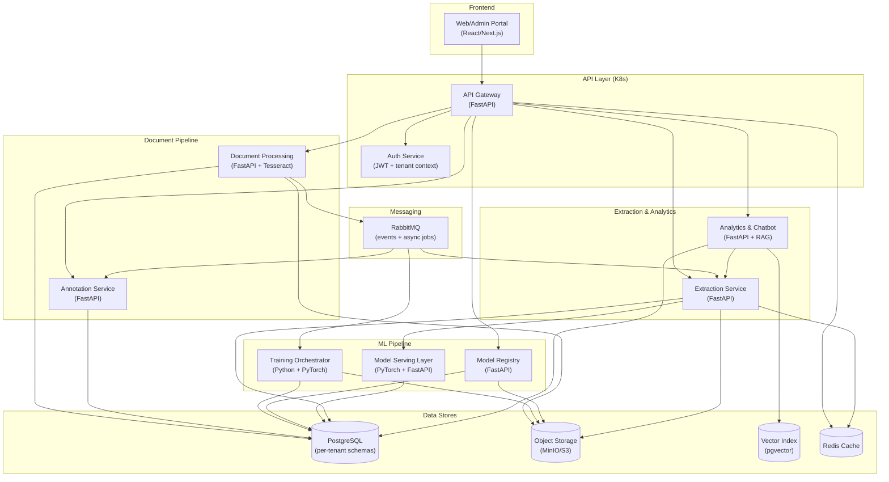
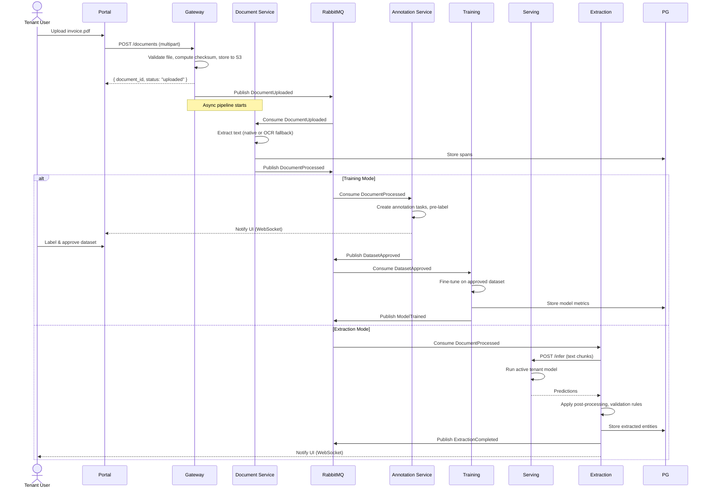

# Technical Design Document — Multi-Tenant Custom NER Platform

| | |
|---|---|
| **Project** | Multi-Tenant Custom Named Entity Recognition Platform |
| **Document** | Technical Design Document v0.1 |
| **Date** | 2026-06-03 |
| **Author** | OpenCode — based on requirements.md and PROJECT.md |
| **Status** | Draft |

---

## Table of Contents

1. [Scope](#1-scope)
2. [Assumptions & Constraints](#2-assumptions--constraints)
3. [Requirements](#3-requirements)
4. [Architecture](#4-architecture)
5. [Services & Modules](#5-services--modules)
6. [CI/CD](#6-cicd)
7. [Observability](#7-observability)
8. [Success Criteria](#8-success-criteria)

---

## 1. Scope

| | Items |
|---|---|
| **In Scope** | Design for all 9 services (Portal, Gateway, Document Processing, Annotation, Training Orchestrator, Model Registry, Model Serving, Extraction, Analytics & Chatbot). Tenant isolation via separate PostgreSQL schemas. Full RAG chatbot architecture. OCR fallback pipeline. CI/CD pipeline. Observability stack. OpenSpec/OpenCode SDD integration. |
| **Out of Scope** | Production-grade SOC 2/ISO 27001 certification. Cross-tenant model pooling without opt-in. Layout-aware model (LayoutLM/Donut) integration — evaluated but deferred. Automated model creation without human annotation. Tenant-selectable base models. |

---

## 2. Assumptions & Constraints

| Type | Detail |
|---|---|
| **Assumption** | Python 3.12+ and Node.js 22 LTS runtimes are available in the target deployment environment. |
| **Assumption** | All services will run in Kubernetes (K8s) with GPU node pools available for training. |
| **Assumption** | Each tenant's dataset will have at least 500 labeled entities per entity type before training is permitted. |
| **Assumption** | OCR will be performed by Tesseract (open-source baseline) with optional Azure Document Intelligence as a premium upgrade path. |
| **Assumption** | Chatbot LLM will be provided by OpenAI API (GPT-4o-class) with tenant-scoped API keys. |
| **Assumption** | Message broker will be RabbitMQ (simpler for event-driven CRUD) with evaluation for Kafka if throughput exceeds 10K events/sec. |
| **Constraint** | Single curated base model only — dslim/bert-base-NER. No BYOM or tenant-selectable base models. |
| **Constraint** | Tenant isolation via separate PostgreSQL schemas only. No cross-schema queries. |
| **Constraint** | JWT-based auth with tenant context embedded in the token. |
| **Constraint** | Maximum 10 model versions retained per tenant. |
| **Constraint** | Minimum OCR confidence threshold: 0.70. Below-threshold documents require human review. |
| **Constraint** | Chatbot responses must cite sources. Unsupported question types must be blocked. |
| **Constraint** | All feature work must follow OpenSpec SDD: proposal → design → spec → tasks → evidence → archive. |

---

## 3. Requirements

### 3.1 Functional Requirements — API Contracts

#### FR-01: Tenant Management

```
POST   /api/v1/admin/tenants                          → Create tenant
GET    /api/v1/admin/tenants                           → List tenants
GET    /api/v1/admin/tenants/{tenant_id}               → Get tenant details
PATCH  /api/v1/admin/tenants/{tenant_id}               → Update tenant (quotas, policy)
DELETE /api/v1/admin/tenants/{tenant_id}               → Deactivate tenant

Request (POST/PATCH):
{
  "name": "string",
  "isolation_policy": "schema_per_tenant",
  "quotas": {
    "max_users": 50,
    "max_docs": 10000,
    "max_storage_gb": 100,
    "max_model_versions": 10
  }
}

Response:
{
  "tenant_id": "uuid",
  "name": "string",
  "status": "active",
  "schema_name": "tenant_<uuid>",
  "quotas": { ... },
  "created_at": "datetime"
}

Errors: 400 (invalid), 409 (duplicate name), 403 (unauthorized)
```

#### FR-02: Entity Definition

```
POST   /api/v1/tenants/{tenant_id}/entities           → Create entity type
GET    /api/v1/tenants/{tenant_id}/entities            → List entity types
GET    /api/v1/tenants/{tenant_id}/entities/{entity_id} → Get entity version
PATCH  /api/v1/tenants/{tenant_id}/entities/{entity_id} → Update entity (new version)

Request (POST):
{
  "name": "invoice_number",
  "description": "Invoice reference number",
  "examples": ["INV-2024-001", "INV-2024-002"],
  "aliases": ["invoice_ref", "invoice_id"],
  "expected_format": "INV-\\d{4}-\\d{3}",
  "validation_rule": {"type": "regex", "pattern": "^INV-\\d{4}-\\d{3}$"},
  "target_table": "invoices",
  "target_column": "invoice_number",
  "required_flag": true
}

Response:
{
  "entity_id": "uuid",
  "version": 1,
  "status": "draft",
  ...  // all request fields echoed
}

Errors: 400 (invalid), 422 (validation rule malformed)
```

#### FR-03: Document Upload

```
POST   /api/v1/tenants/{tenant_id}/documents          → Upload document
GET    /api/v1/tenants/{tenant_id}/documents           → List documents (paginated)
GET    /api/v1/tenants/{tenant_id}/documents/{doc_id}  → Get document status
DELETE /api/v1/tenants/{tenant_id}/documents/{doc_id}  → Soft-delete document

Request (POST):
Content-Type: multipart/form-data
file: <binary>
metadata: {"source": "email_attachment", "tags": ["urgent"]}

Response:
{
  "document_id": "uuid",
  "filename": "invoice_2024_001.pdf",
  "mime_type": "application/pdf",
  "file_size_bytes": 245760,
  "checksum": "sha256:abc123...",
  "storage_uri": "s3://tenant-<uuid>/documents/abc123...",
  "status": "uploaded",
  "created_at": "datetime"
}

Supported formats: PDF, DOCX, TXT, CSV, JPEG, PNG, TIFF
Max file size: 50 MB (configurable per tenant)
Errors: 400 (unsupported format), 413 (file too large), 422 (malware detected)
```

#### FR-04: Text Extraction & OCR

```
Internal service — triggered asynchronously after DocumentUploaded event.
Output stored to document_text_span table.

POST /api/v1/internal/documents/{doc_id}/process  (internal)

Request (async via message broker):
{
  "document_id": "uuid",
  "tenant_id": "uuid",
  "storage_uri": "s3://...",
  "mime_type": "application/pdf"
}

Processing logic:
  1. If mime_type in [PDF, DOCX, TXT]:
     a. Attempt native text extraction
     b. If text layer found → store spans directly
     c. If no text layer → trigger OCR fallback
  2. If mime_type in [JPEG, PNG, TIFF]:
     a. Run OCR (Tesseract)
     b. If OCR confidence >= 0.70 → store spans with ocr_confidence
     c. If OCR confidence < 0.70 → flag for human review
  3. Publish DocumentProcessed event
```

#### FR-05: Annotation

```
POST   /api/v1/tenants/{tenant_id}/annotations/tasks           → Create annotation task
GET    /api/v1/tenants/{tenant_id}/annotations/tasks            → List tasks
PATCH  /api/v1/tenants/{tenant_id}/annotations/tasks/{task_id}  → Update task (assign, submit, approve/reject)
POST   /api/v1/tenants/{tenant_id}/annotations/tasks/{task_id}/labels  → Add label
GET    /api/v1/tenants/{tenant_id}/annotations/tasks/{task_id}/labels  → Get labels
POST   /api/v1/tenants/{tenant_id}/annotations/export            → Export approved dataset in BIO/IOB2

Export response:
{
  "dataset_version": "v3",
  "format": "BIO",
  "download_url": "s3://tenant-<uuid>/datasets/v3/conll-format.txt",
  "entity_count": 1500,
  "document_count": 45
}

Pre-labeling:
- When task is created, system runs base NER model on document spans
- Pre-labels stored with confidence; annotator can accept/correct/reject
```

#### FR-06: Training Trigger

```
POST /api/v1/tenants/{tenant_id}/training/jobs  → Trigger training

Request:
{
  "dataset_version": "v3",
  "entity_config_version": 2,
  "base_model": "dslim/bert-base-NER",
  "hyperparameters": {
    "learning_rate": 2e-5,
    "num_epochs": 3,
    "batch_size": 16,
    "max_seq_length": 128
  }
}

Response:
{
  "job_id": "uuid",
  "status": "queued",
  "estimated_duration_seconds": 600
}

GET /api/v1/tenants/{tenant_id}/training/jobs/{job_id} → Get job status

Response:
{
  "job_id": "uuid",
  "status": "running",
  "progress": 0.45,
  "current_epoch": 2,
  "metrics_uri": "s3://tenant-<uuid>/training/v3/metrics.json",
  "started_at": "datetime",
  "estimated_completion": "datetime"
}

Errors: 400 (dataset too small), 422 (entity config changed during annotation)
```

#### FR-07: Model Evaluation & Promotion

```
GET  /api/v1/tenants/{tenant_id}/models/{model_id}/evaluation → Get evaluation metrics

Response:
{
  "model_id": "uuid",
  "version": 3,
  "metrics": {
    "precision": 0.87,
    "recall": 0.83,
    "f1": 0.85,
    "per_entity": {
      "invoice_number": {"precision": 0.92, "recall": 0.89, "f1": 0.90},
      "customer_name": {"precision": 0.85, "recall": 0.80, "f1": 0.82}
    },
    "confusion_matrix_url": "s3://.../confusion_matrix.png",
    "thresholds_met": true
  },
  "promotion_eligible": true,
  "manual_approval_required": true
}

POST /api/v1/tenants/{tenant_id}/models/{model_id}/promote → Promote model

Request:
{
  "approved_by": "user_id",
  "notes": "F1 meets threshold. Manual validation passed."
}

Response:
{
  "model_id": "uuid",
  "version": 3,
  "status": "active",
  "previous_active_version": 2,
  "rollback_available": true
}

Automatic rollback available: POST /api/v1/tenants/{tenant_id}/models/rollback/{version}
```

#### FR-08: Model Serving

```
Internal — no direct external API. Model Serving Layer exposes an internal gRPC or HTTP endpoint:

POST /internal/v1/tenants/{tenant_id}/infer

Request:
{
  "text_chunks": [
    {"chunk_id": "1", "text": "Invoice INV-2024-001 dated 2024-01-15", "span_id": "uuid"}
  ]
}

Response:
{
  "predictions": [
    {
      "chunk_id": "1",
      "entities": [
        {"entity_type": "invoice_number", "value": "INV-2024-001", "confidence": 0.94, "start": 8, "end": 21},
        {"entity_type": "date", "value": "2024-01-15", "confidence": 0.97, "start": 30, "end": 40}
      ]
    }
  ],
  "model_version": 3,
  "inference_ms": 45
}
```

#### FR-09 / FR-10: Extraction & Review

```
POST   /api/v1/tenants/{tenant_id}/extraction/runs             → Trigger extraction run
GET    /api/v1/tenants/{tenant_id}/extraction/runs               → List runs
GET    /api/v1/tenants/{tenant_id}/extraction/runs/{run_id}      → Get run status
GET    /api/v1/tenants/{tenant_id}/extraction/entities           → Query extracted entities
PATCH  /api/v1/tenants/{tenant_id}/extraction/entities/{result_id} → Correct/review entity

Extraction trigger response:
{
  "run_id": "uuid",
  "document_id": "uuid",
  "document_count": 1,
  "model_version": 3,
  "status": "queued"
}

Entity query:
GET /api/v1/tenants/{tenant_id}/extraction/entities?
  confidence_lt=0.7&entity_type=invoice_number&review_status=unreviewed&page=1&per_page=50

Entity correction:
PATCH /api/v1/tenants/{tenant_id}/extraction/entities/{result_id}
Request:
{
  "review_status": "corrected",
  "corrected_value": "INV-2024-001",
  "correction_notes": "OCR misread dash as space"
}
```

#### FR-11: Chatbot

```
POST /api/v1/tenants/{tenant_id}/chat/query

Request:
{
  "query": "What was the total value of invoices from Acme Corp in January 2024?",
  "max_sources": 5
}

Response:
{
  "answer": "The total value of invoices from Acme Corp in January 2024 was $247,500.",
  "sources": [
    {"type": "extracted_entity", "document_id": "uuid", "entity": "invoice_total", "value": "247500", "confidence": 0.98},
    {"type": "extracted_entity", "document_id": "uuid", "entity": "customer_name", "value": "Acme Corp"},
    {"type": "document", "document_id": "uuid", "snippet": "...Invoice INV-2024-015 - Acme Corp - $247,500..."}
  ],
  "confidence": "high",
  "disclaimer": "This answer is generated from extracted data and may not reflect real-time changes."
}
```

#### FR-12: Reports

```
GET /api/v1/tenants/{tenant_id}/reports/coverage
  ?start_date=2024-01-01&end_date=2024-12-31
  &entity_type=invoice_number
  &model_version=3

Response:
{
  "total_documents": 1200,
  "total_entities_extracted": 8500,
  "coverage_by_entity": {
    "invoice_number": {"expected": 1200, "extracted": 1180, "coverage_pct": 98.3},
    "customer_name": {"expected": 1200, "extracted": 1150, "coverage_pct": 95.8}
  },
  "confidence_distribution": {
    "high_0.9_plus": 6800,
    "medium_0.7_to_0.9": 1200,
    "low_below_0.7": 500
  },
  "review_backlog": 200,
  "correction_rate": 0.035
}

GET /api/v1/tenants/{tenant_id}/reports/volume
GET /api/v1/tenants/{tenant_id}/reports/confidence-trends
```

### 3.2 Data Model — Relationships

```
tenant (1) ──── (N) tenant_user
tenant (1) ──── (N) entity_definition
tenant (1) ──── (N) document
tenant (1) ──── (N) training_job
tenant (1) ──── (N) model_version
tenant (1) ──── (N) extraction_run
tenant (1) ──── (N) audit_log

document (1) ──── (N) document_text_span
document (1) ──── (N) annotation_task
document (1) ──── (N) extraction_run

annotation_task (1) ──── (N) annotation_label

training_job (1) ──── (1) model_version

extraction_run (1) ──── (N) extracted_entity
extracted_entity (N) ──── (1) document_text_span
```

**Database migration strategy**: Alembic (Python services). Each service owns its migration files in `src/<service>/migrations/`. Shared `alembic.ini` per service. Schema-per-tenant means migration scripts are applied to each tenant schema on creation and upgraded during rolling deployments.

### 3.3 Frontend Pages & Components

| Route | Page | Components Needed | API Calls | Auth Scope |
|---|---|---|---|---|
| `/admin/tenants` | Tenant Management | `TenantTable`, `TenantForm`, `QuotaEditor` | FR-01 | System Admin |
| `/admin/tenants/:id` | Tenant Detail | `TenantOverview`, `SchemaStatus` | FR-01 | System Admin |
| `/:tenantId/entities` | Entity Catalog | `EntityTable`, `EntityForm`, `ValidationRuleEditor`, `ExampleList` | FR-02 | Tenant Admin |
| `/:tenantId/entities/:id` | Entity Detail | `EntityHistory`, `TargetMapping` | FR-02 | Tenant Admin |
| `/:tenantId/documents` | Document Upload | `DocumentUploader` (drag-drop), `DocumentTable`, `StatusBadge` | FR-03 | All tenant users |
| `/:tenantId/documents/:id` | Document Detail | `TextPreview`, `SpanOverlay`, `OCRErrorBanner` | FR-03, FR-04 | All tenant users |
| `/:tenantId/annotate` | Annotation Workbench | `DocumentViewer`, `SpanSelector`, `EntityPalette`, `LabelList`, `PreLabelAcceptBar`, `ReviewDialog` | FR-05 | Annotator, Reviewer |
| `/:tenantId/training` | Training Jobs | `JobTable`, `JobDetail`, `TriggerForm`, `MetricsChart` | FR-06 | Tenant Admin |
| `/:tenantId/models` | Model Registry | `ModelCard`, `VersionTimeline`, `MetricsPanel`, `PromoteButton`, `RollbackButton` | FR-07 | Tenant Admin, ML Engineer |
| `/:tenantId/extraction` | Extraction Runs | `RunTable`, `RunStatus`, `EntityQueryPanel`, `EntityCorrectionForm` | FR-09, FR-10 | All tenant users |
| `/:tenantId/chat` | Chatbot UI | `ChatWindow`, `SourceCitationCard`, `DisclosureBanner` | FR-11 | All tenant users |
| `/:tenantId/reports` | Reports & Dashboards | `MetricCard`, `TrendChart`, `ConfidenceHistogram`, `CoverageTable`, `DateRangeFilter`, `ExportButton` | FR-12 | All tenant users |
| `/:tenantId/users` | User Management | `UserTable`, `UserForm`, `RoleSelector` | Tenant-scoped user CRUD | Tenant Admin |

### 3.4 Non-Functional Requirements (Design Targets)

| Attribute | Target | Design Implications |
|---|---|---|
| Latency (chatbot P95) | < 10 s | Async extraction pipeline; cached model warmup; RAG query optimization |
| Latency (inference P95) | < 500 ms per chunk | GPU-backed model serving; batching; autoscaling |
| Latency (API P95) | < 200 ms | Connection pooling; Redis cache for entity configs; PgBouncer |
| Throughput (extraction) | 100 docs/min per tenant | Horizontal pod autoscaling; async processing with message queues |
| Training throughput | 1 job per GPU at a time | GPU queue with backpressure; node pool autoscaling |
| Availability | 99.5% monthly | K8s multi-AZ; health probes; circuit breakers; graceful degradation |
| Recovery (RPO) | 5 min | WAL streaming for PostgreSQL; synchronous S3 replication |
| Recovery (RTO) | 30 min | Helm rollback; DB restore from latest WAL; cached models pre-loaded |
| Security | OWASP Top 10 + tenant isolation | JWT with tenant context; schema isolation; per-request authz; input validation; malware scan hook |

---

## 4. Architecture

### 4.1 High-Level Architecture



### 4.2 Data Flow: Document Upload → Extraction



### 4.3 Tenant Isolation Design

```
┌──────────────────────────────────────────────┐
│            PostgreSQL Instance                │
│                                                │
│  Schema: tenant_uuid_1                         │
│  ├─ tenant (1 row)                             │
│  ├─ tenant_user                                │
│  ├─ entity_definition                          │
│  ├─ document                                   │
│  ├─ document_text_span                         │
│  ├─ annotation_task                            │
│  ├─ annotation_label                           │
│  ├─ training_job                               │
│  ├─ model_version                              │
│  ├─ extraction_run                             │
│  ├─ extracted_entity                           │
│  └─ audit_log                                  │
│                                                │
│  Schema: tenant_uuid_2                         │
│  ├─ (same tables, isolated data)               │
│                                                │
│  Schema: tenant_uuid_N                         │
│  └─ ...                                        │
│                                                │
│  Schema: public                                │
│  └─ migration tracking (alembic_version)       │
└──────────────────────────────────────────────┘
```

- Application layer enforces tenant context via JWT `tenant_id` claim
- All SQL queries include `SET search_path TO tenant_<uuid>` at connection level
- API Gateway injects `X-Tenant-ID` header after JWT validation
- Object storage: separate prefix `s3://ner-platform/tenant-<uuid>/documents/`
- Model artifacts: separate prefix `s3://ner-platform/tenant-<uuid>/models/`

### 4.4 Technology Choices & Rationale

| Component | Choice | Rationale |
|---|---|---|
| Backend framework | FastAPI | Async-native, automatic OpenAPI docs, Pydantic validation, Python ecosystem for ML |
| Frontend | Next.js 14 (App Router) | Server components for SSR, React for rich annotation UI, TypeScript |
| Database | PostgreSQL 16 + pgvector | JSONB for flexible entities, vector extension for semantic search, schema-per-tenant support |
| Object storage | MinIO (dev) → S3 (prod) | S3 API compatible, MinIO for local dev parity |
| Message broker | RabbitMQ | Mature, easy operation, good fit for event-driven CRUD; evaluate Kafka if >10K events/sec |
| Cache | Redis 7 | Entity config cache, inference result cache, session store |
| ML framework | PyTorch 2.x + Hugging Face Transformers | Industry standard for fine-tuning, ONNX export for serving |
| Search | pgvector (in-PG) | Avoids operational overhead of a separate search cluster for initial release |
| Container | Docker + K8s (k3s dev / EKS prod) | Standard orchestration, GPU node pools, autoscaling |
| IaC | Terraform | Cloud-agnostic, wide K8s provider support |
| CI/CD | GitHub Actions | Repository-hosted, native K8s integration |
| Observability | Prometheus + Grafana + Loki | CNCF standard, OpenTelemetry integration, cost-effective |

---

## 5. Services & Modules

| Name | Responsibility | Technology | Interfaces (sync in / async in / out) |
|---|---|---|---|
| **Portal** (frontend) | Web UI for all personas: entity config, upload, annotation, training, extraction, chatbot, reports | Next.js 14, TypeScript, Tailwind CSS | Sync: REST to Gateway. Events: WebSocket for status updates. |
| **API Gateway & Backend** | Tenant-aware authz, request validation, audit logging, async job orchestration | FastAPI, Python 3.12, Pydantic v2 | Sync in: HTTP from Portal. Sync out: REST to services. Async out: RabbitMQ events. |
| **Document Processing** | File validation, malware scan, OCR (Tesseract), text extraction, span mapping | FastAPI, Python, pytesseract, PyMuPDF, python-docx | Async in: DocumentUploaded. Sync out: none. Async out: DocumentProcessed. |
| **Annotation Service** | Task lifecycle, pre-labeling, reviewer workflow, dispute resolution, BIO/IOB2 export | FastAPI, Python, Hugging Face pipeline | Sync in: HTTP crud from Portal. Async in: DocumentProcessed. Async out: DatasetApproved. |
| **Training Orchestrator** | Fine-tuning job lifecycle, GPU queue management, metrics persistence | Python, PyTorch, Hugging Face Trainer, Celery (GPU workers) | Async in: DatasetApproved. Async out: ModelTrained, TrainingFailed. |
| **Model Registry** | Version catalog, metrics storage, approval workflow, artifact links | FastAPI, Python | Sync in: HTTP from Portal + Training. Async in: ModelTrained. Async out: ModelPromoted. |
| **Model Serving Layer** | Inference endpoint per tenant, model warmup, autoscaling, version pinning | Python, PyTorch, FastAPI, ONNX Runtime | Sync in: gRPC/HTTP from Extraction. Async in: ModelPromoted. |
| **Extraction Service** | Entity extraction, post-processing validation rule engine, correction workflow | FastAPI, Python | Async in: DocumentProcessed. Sync in: HTTP crud from Portal. Async out: ExtractionCompleted. |
| **Analytics & Chatbot** | RAG query: SQL + vector search + NER inference, source-based answering, guardrails | FastAPI, Python, LangChain / LlamaIndex, OpenAI API | Sync in: HTTP from Portal. Async in: ExtractionCompleted. |

### Shared Modules

| Module | Location | Purpose |
|---|---|---|
| `shared/tenant_context` | `src/shared/tenant_context.py` | Tenant ID extraction from JWT, `search_path` injection for SQLAlchemy |
| `shared/event_schema` | `src/shared/events.py` | Pydantic models for all RabbitMQ events |
| `shared/auth` | `src/shared/auth.py` | JWT decode, role verification, permission checks |
| `shared/audit` | `src/shared/audit.py` | Audit log writer (called by each service for state-changing actions) |
| `shared/storage` | `src/shared/storage.py` | S3/MinIO client wrapper (upload, download, presigned URL) |

---

## 6. CI/CD

### 6.1 Pipeline Overview

| Stage | Tool / Action | Environment | Notes |
|---|---|---|---|
| Lint | `ruff check src/` (Python), `npm run lint` (TS) | All | Fail on lint errors |
| Type Check | `mypy src/` (Python), `npm run typecheck` (TS) | All | Fail on type errors |
| Unit Tests | `pytest tests/unit/` (Python), `npm test` (TS) | All | Coverage threshold: 80% |
| Integration Tests | `pytest tests/integration/` (with Testcontainers) | All | DB, object store, broker required |
| Security Scan | `bandit` (Python SAST), `npm audit`, Trivy (container) | All | Fail on critical/high |
| Build | `docker build` per service, `npm run build` (frontend) | All | Tag with commit SHA + version |
| Push | `docker push` to container registry | Dev / Staging / Prod | ECR / Docker Hub |
| Deploy (Dev) | `helm upgrade` with dev values | Dev | Automatic on main branch |
| Deploy (Staging) | Manual promotion via GitHub Environments | Staging | Requires PR approval + smoke test |
| Deploy (Prod) | Manual approval gate | Prod | Requires staging sign-off |
| Smoke Test | Health check + extraction of known test document | Post-deploy | Fail → auto-rollback |
| Schema Migration | Alembic migration run as init container | Pre-deploy | Backward-compatible only |

### 6.2 Branch Strategy

```
feature/FR-XX-entity-catalog  ──┐
feature/FR-XX-document-upload ──┤
                                ├──→ dev ──→ staging ──→ main (prod)
feature/FR-XX-annotation-UI   ──┘
                                  ↑
                             PR with:
                             - lint + typecheck + unit + integration
                             - security scan pass
                             - OpenSpec evidence update
```

- `main`: Production. Protected branch. Requires PR + 2 approvals.
- `staging`: Pre-production. Deployed after OpenSpec Archive Gate.
- `dev`: Integration branch. Auto-deployed. May be unstable.

### 6.3 Secret Injection

- **Locally**: `.env` files (gitignored) per service
- **CI/CD**: GitHub Actions Secrets → mapped to environment variables
- **K8s**: External Secrets Operator → pulls from Azure Key Vault / AWS Secrets Manager
- **Secrets list**: `DATABASE_URL`, `RABBITMQ_URL`, `REDIS_URL`, `JWT_SECRET`, `OPENAI_API_KEY`, `S3_ENDPOINT`, `S3_ACCESS_KEY`, `S3_SECRET_KEY`

### 6.4 Rollback Approach

1. **Helm rollback**: `helm rollback <release> <revision>`
2. **DB rollback**: `alembic downgrade -1` (must be backward-compatible)
3. **Model rollback**: API endpoint `POST /api/v1/tenants/{tenant_id}/models/rollback/{version}`
4. **Auto-rollback trigger**: Smoke test failure after deployment

---

## 7. Observability

### 7.1 Logging

| Attribute | Standard |
|---|---|
| Format | JSON structured (`service`, `tenant_id`, `request_id`, `level`, `message`, `timestamp`, `duration_ms`) |
| Correlation ID | `X-Request-ID` header (UUID v4), propagated via HTTP headers + message headers |
| Retention | 30 days hot (Elasticsearch/Loki), 12 months cold (S3 archive) |
| Levels | `error` (action required), `warn` (degradation), `info` (state changes), `debug` (trace, off in prod) |

### 7.2 Metrics (Prometheus)

| Metric | Type | Labels | Alert Threshold |
|---|---|---|---|
| `http_requests_total` | Counter | `service`, `method`, `path`, `status_code` | P99 latency > 500ms |
| `http_request_duration_seconds` | Histogram | `service`, `method`, `path` | P95 > 200ms (API), P95 > 500ms (inference) |
| `inference_latency_seconds` | Histogram | `tenant_id`, `model_version` | P95 > 1s |
| `extraction_confidence` | Gauge | `tenant_id`, `entity_type` | < 0.70 for any entity type → warn |
| `training_duration_seconds` | Histogram | `tenant_id`, `status` | > 2x estimated → alert |
| `model_f1_score` | Gauge | `tenant_id`, `model_version`, `entity_type` | < 0.80 → alert ML engineer |
| `queue_depth` | Gauge | `queue_name` | > 1000 → scale workers |
| `circuit_state` | Gauge | `service`, `circuit_name` | state=1 (open) → page on-call |
| `cache_hit_ratio` | Gauge | `service`, `cache_name` | < 0.5 → investigate |
| `tenant_document_volume` | Counter | `tenant_id`, `document_type` | — |

### 7.3 Tracing (OpenTelemetry + Jaeger)

- **Instrumentation**: Automatic via OpenTelemetry SDK auto-instrumentation (Python + Node.js)
- **Trace propagation**: W3C Trace Context (`traceparent` header) across HTTP + RabbitMQ message headers
- **Sampling**: Head-based (10% for API, 100% for training/inference)
- **Key trace origins**: Document upload → extraction end-to-end, training job lifecycle, chatbot query → RAG pipeline

### 7.4 Dashboards & Alerts

| Dashboard | Panels | Audience |
|---|---|---|
| **Service Health** | Request rate, error rate, latency (P50/P95/P99), CPU/memory per pod | All engineers |
| **Extraction Performance** | Extraction throughput, confidence distribution, review backlog, model version metrics | Tenant Admin, ML Engineer |
| **Training Monitor** | Job queue depth, GPU utilization, training duration, F1 trend per model version | ML Engineer, System Admin |
| **Tenant Isolation** | Cross-tenant access attempts (audit log), schema size, quota utilization | System Admin |
| **Chatbot Quality** | Query volume, response time, source citation rate, blocked query rate | Product Owner, Tenant Admin |

### 7.5 Health Checks

| Endpoint | Purpose | Expected Response |
|---|---|---|
| `/health/live` | K8s liveness probe | `200 OK` |
| `/health/ready` | K8s readiness probe (DB, broker, cache connectivity) | `200 OK` or `503` |
| `/health/model` | Model serving only: model loaded and warmed up | `200 { "model_version": 3, "warm": true }` |

---

## 8. Success Criteria

| Deliverable | Success Criteria | Verification Method |
|---|---|---|
| Tenant provisioning flow | System Admin can create tenant with isolated schema, storage, and model namespace in < 30s | Automated integration test |
| Entity catalog CRUD | Tenant Admin can create, update, version, and validate entity definitions | E2E test via Portal |
| Document upload + text extraction | Document of each supported format (PDF, DOCX, TXT, JPEG) processed, spans stored, OCR fallback invoked for scanned PDF | Integration test with fixtures |
| Annotation workflow | Annotator can label spans, pre-labels populated, reviewer approves, BIO/IOB2 export produces valid CoNLL format | E2E test |
| Training pipeline | Training job completes on a dataset of 500+ entities, produces model with F1 >= 0.70, metrics persisted | Integration test with GPU emulation |
| Model promotion | Candidate model can be promoted via API only when thresholds met AND manual approval provided | Unit + integration test |
| Extraction end-to-end | Document → extraction → stored entity with source span, confidence, model version | E2E test with known document |
| Entity correction | Low-confidence entity can be corrected, correction appears in feedback queue | Integration test |
| Chatbot query | Query returns answer with source citations for known data; unsupported query returns graceful block message | Integration test with test dataset |
| Tenant isolation | Cross-tenant query returns zero data; tenant A's schema is invisible to tenant B | Penetration test |
| Rollback | Model rollback via API completes in < 10 min; previous version serves requests | Integration test |
| CI/CD pipeline | PR triggers lint, test, security scan, build; merge to dev auto-deploys; staging requires manual approval | GitHub Actions status check |
| Observability | All services emit Prometheus metrics, structured JSON logs, and OpenTelemetry traces | Smoke test after deploy |
| API contract compliance | All endpoints return correct status codes, shapes, and error schemas per OpenAPI spec | Contract test suite (pytest + schemathesis) |
